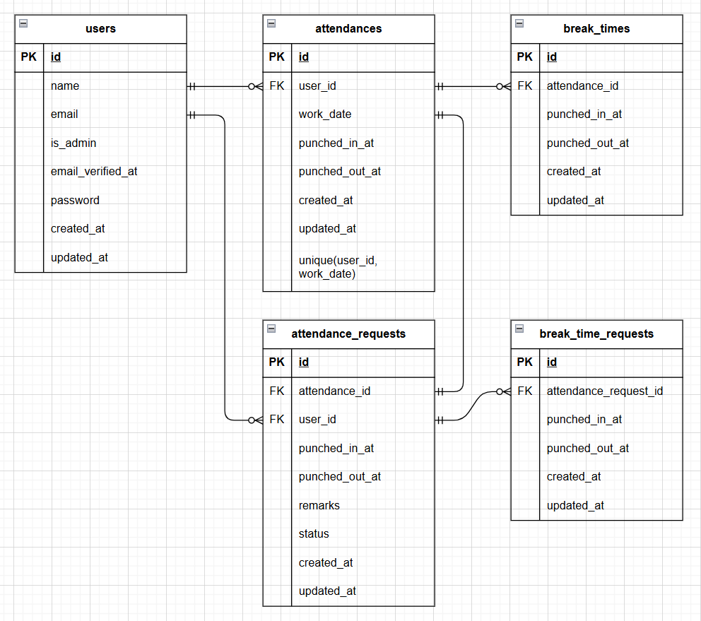

# attendance-management（勤怠管理アプリ）
## プロジェクト概要
本アプリは、Laravelフレームワークを使用した、勤怠管理アプリです。
### 主な機能（一般ユーザー）
- 出勤、退勤、休憩時間の打刻
- 勤怠修正申請（勤怠記録のある日付のみ勤怠一覧の詳細リンクより可能）
- 勤怠、申請の一覧表示
### 主な機能（管理者ユーザー）
- 勤怠、スタッフ、申請の一覧表示
- 一般ユーザーによる勤怠修正申請に対する承認
- 勤怠の修正
## 環境構築
### Dockerビルド
1. ```git@github.com:kooooooota/attendance-management.git```
2. DockerDesktopアプリを立ち上げる
3. ```docker-compose up -d --build```
### Laravel環境構築
1. docker-compose exec php bash
2. composer install
3. 「.env.example」ファイルを複製し、「.env」ファイルを作成する。
4. envに以下の環境変数を追加
```bash
DB_CONNECTION=mysql  
DB_HOST=mysql  
DB_PORT=3306  
DB_DATABASE=laravel_db  
DB_USERNAME=laravel_user  
DB_PASSWORD=laravel_pass  
    
MAIL_FROM_ADDRESS=system-test@example.com
```
5. アプリケーションキーの作成
```bash
php artisan key:generate  
```
6. マイグレーションの実行
```bash
php artisan migrate
```
7. シーディングの実行
```bash
php artisan db:seed  
```
## テスト実行方法
1. テスト用データベースを準備する  
- MySQLコンテナからMySQLに、rootユーザーでログインする。  
パスワードは、rootを入力（docker-compose.ymlに記載）
```bash
mysql -u root -p
```
- ログイン後、データベースを作成する。
```bash
CREATE DATABASE demo_test;
```
- 作成されているか確認する。
```bash
SHOW DATABASES;
```
2. 「.env.testing.example」ファイルを複製し、「.env.testing」ファイルを作成する。  
```bash
cp .env.testing.example .env.testing
```
3. 「.env.testing」ファイルのAPP_ENVとAPP_KEYを編集する。 
```text 
APP_ENV=test
APP_KEY=
```
4. 「.env.testing」ファイルのデータベースの接続情報を編集する。  
```text
DB_DATABASE=demo_test
DB_USERNAME=root
DB_PASSWORD=root
```
5. APP_KEYに新たにテスト用のアプリケーションキーを加える。
```bash
php artisan key:generate --env=testing
```
6. キャッシュのクリアをする。
```bash
php artisan config:clear
```
7. テスト用のテーブルを作成する。
```bash
php artisan migrate --env=testing
```
8. テスト実行  
- 全テスト実行: `vendor/bin/phpunit tests/Feature`  
- 特定のテスト: `vendor/bin/phpunit tests/Feature/テストファイル名`
## 使用技術
- PHP8.3.0
- Laravel8.83.27
- MySQL8.0.26
- nginx1.21.1
- Mailhog
## ER図

## URL
- 開発環境：http://localhost/
- phpMyAdmin:：http://localhost:8080/